# 课有度动作数据集

面向中文健身应用与开发者的结构化动作数据集。每条记录包含中文名称、动作步骤、身体部位、器械信息，以及 AI 生成的开始、结束和缩略图。

> 重要提示：这些内容尚未经过运动医学人员或专业教练逐项审核。图片经过结构、透视、握法与支撑关系的 AI 目视筛选，但仍可能存在错误。本项目不构成训练、医疗或安全建议。

## 数据内容

- 可离线检索的结构化动作记录。
- 与动作记录对应的 WebP 开始图、结束图和缩略图。
- 规范 JSON、JSON Schema 和可直接打开的离线浏览页。
- 明确的数据来源、媒体署名、许可证和专业审核状态。

## 图片示例

以下示例直接引用仓库内的 AI 生成图片，分别展示动作的开始与结束姿势。

<table>
  <thead>
    <tr>
      <th>动作</th>
      <th>开始</th>
      <th>结束</th>
    </tr>
  </thead>
  <tbody>
    <tr>
      <td>俯卧撑</td>
      <td>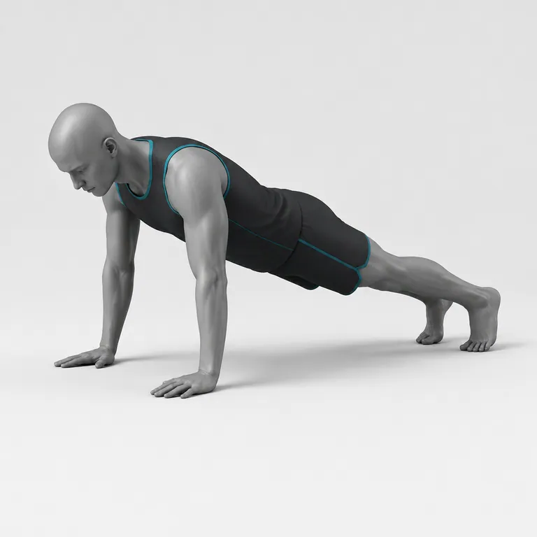</td>
      <td>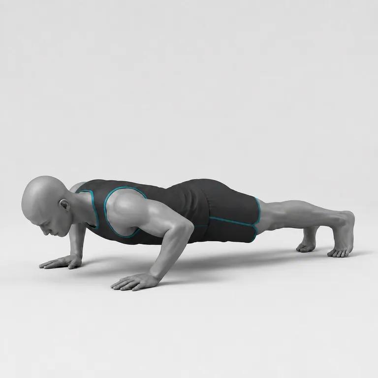</td>
    </tr>
    <tr>
      <td>徒手深蹲</td>
      <td>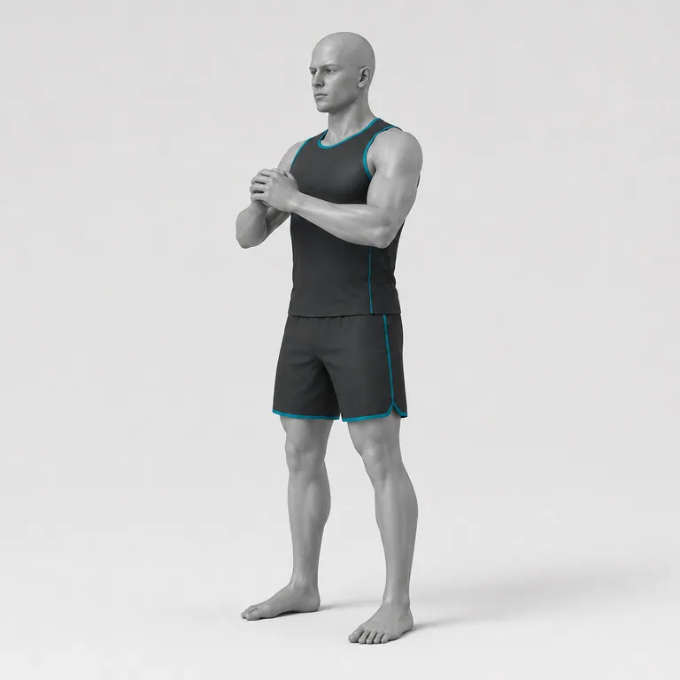</td>
      <td>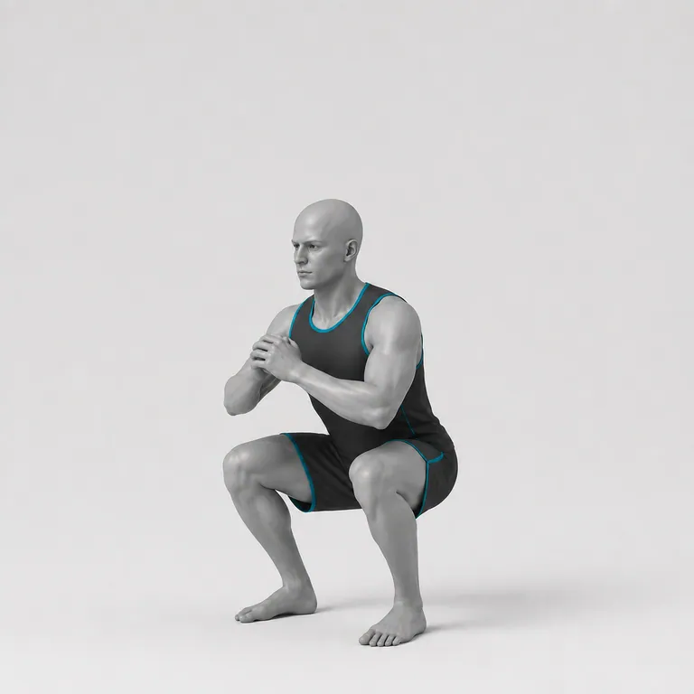</td>
    </tr>
    <tr>
      <td>哑铃弯举</td>
      <td>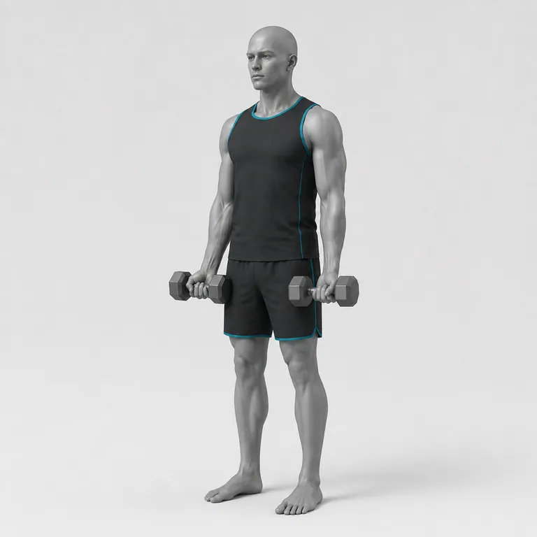</td>
      <td>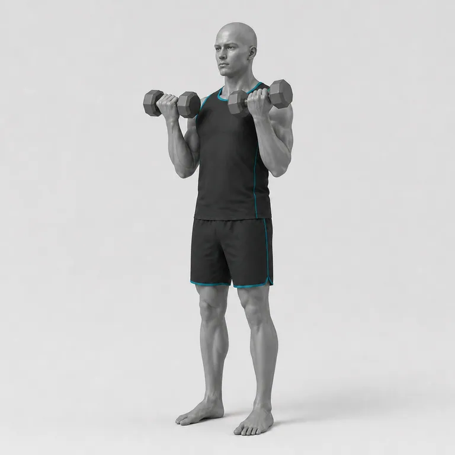</td>
    </tr>
  </tbody>
</table>

### 复杂器械示例

<table>
  <thead>
    <tr>
      <th>动作</th>
      <th>开始</th>
      <th>结束</th>
    </tr>
  </thead>
  <tbody>
    <tr>
      <td>绳索中位夹胸（龙门架）</td>
      <td>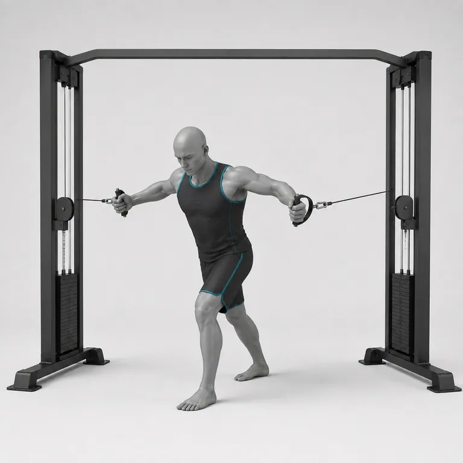</td>
      <td>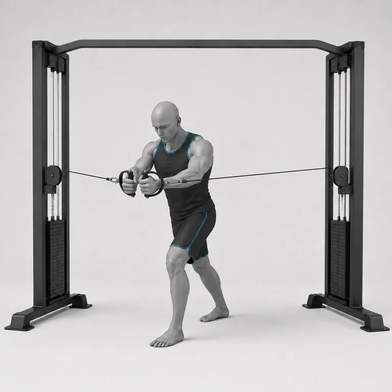</td>
    </tr>
    <tr>
      <td>绳索高位下拉</td>
      <td>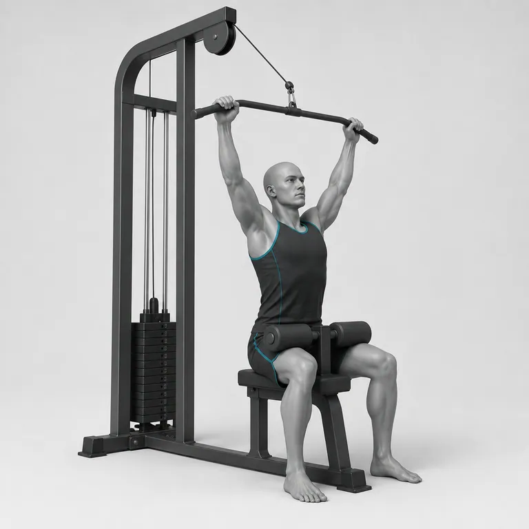</td>
      <td>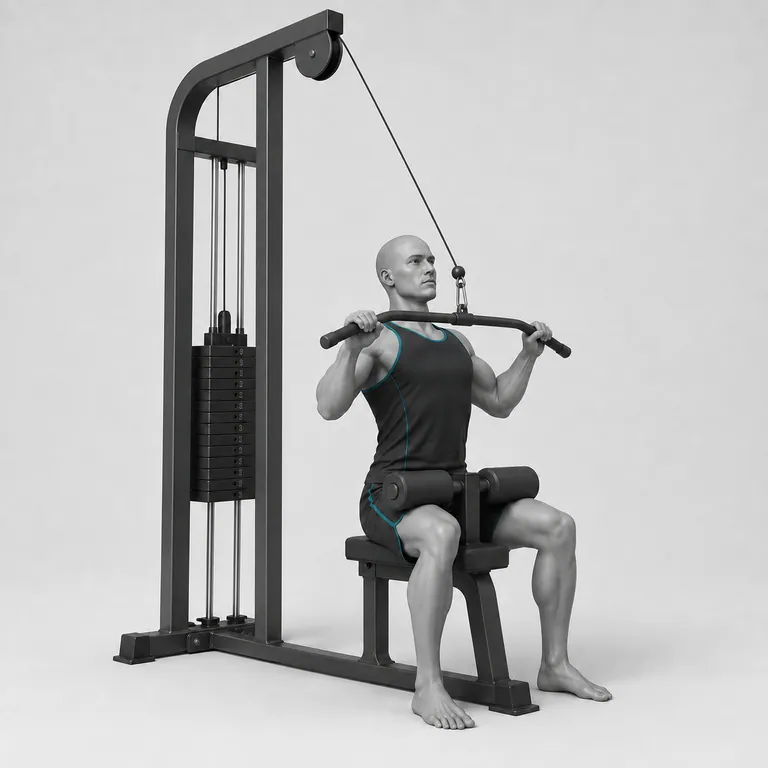</td>
    </tr>
    <tr>
      <td>器械坐姿划船</td>
      <td>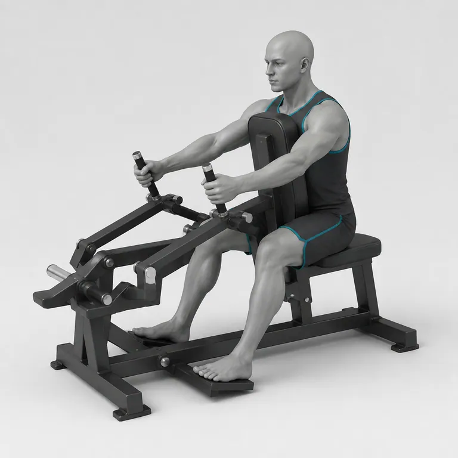</td>
      <td>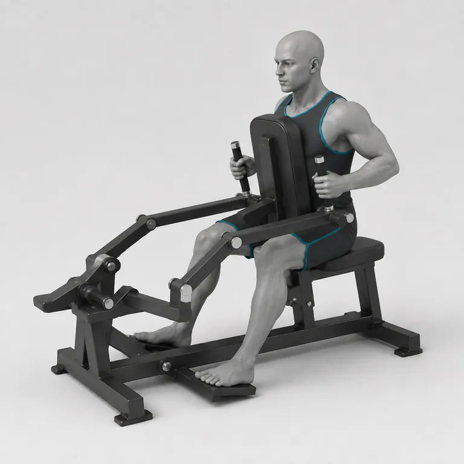</td>
    </tr>
    <tr>
      <td>器械 45 度腿举</td>
      <td>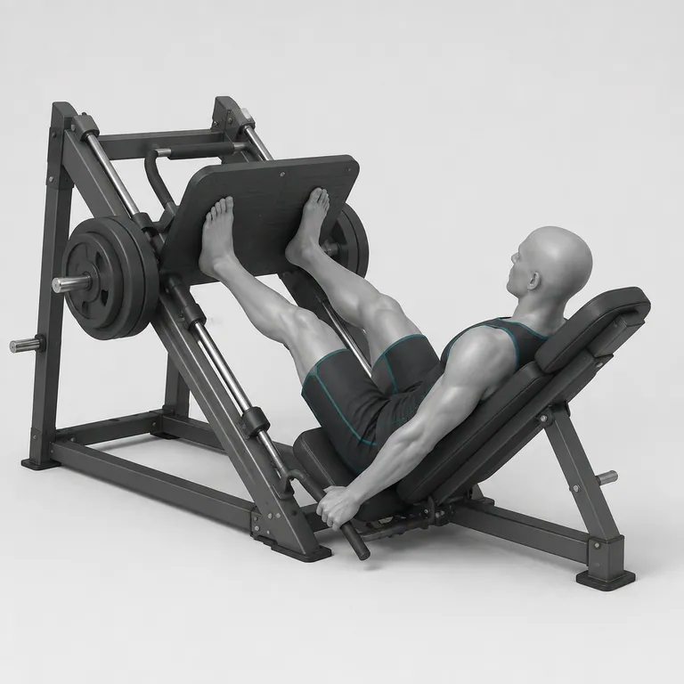</td>
      <td>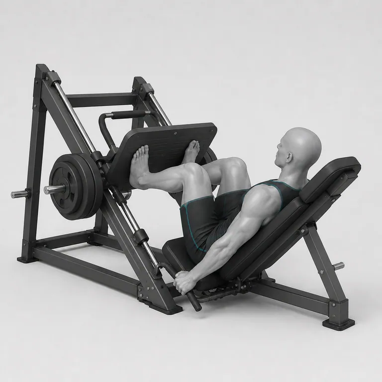</td>
    </tr>
    <tr>
      <td>哈克深蹲</td>
      <td>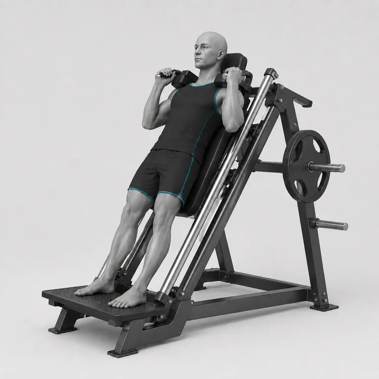</td>
      <td>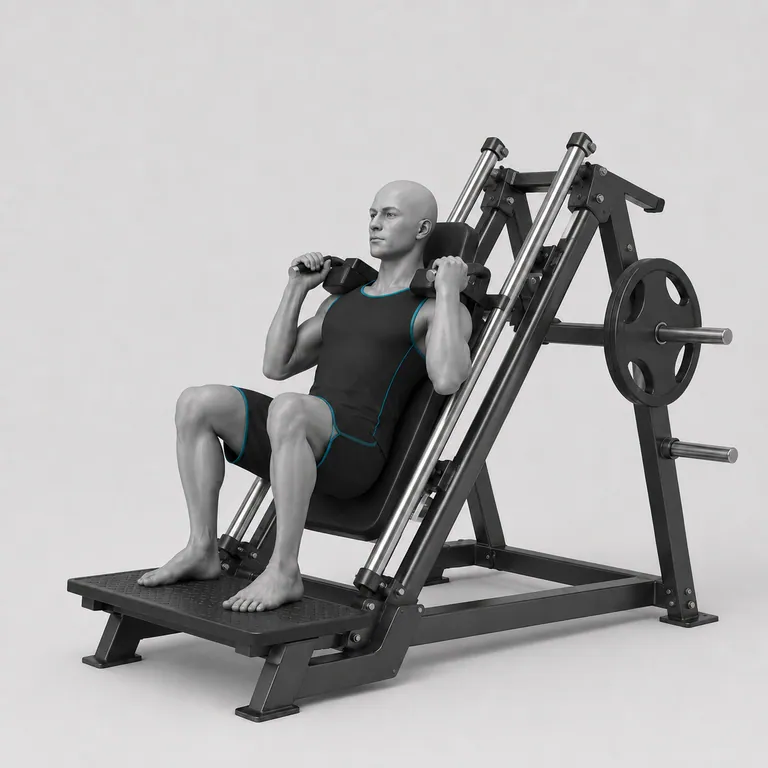</td>
    </tr>
  </tbody>
</table>

## 快速使用

直接双击根目录的 index.html，即可离线搜索、筛选并对照动作开始和结束图，不需要安装依赖或启动服务器。

数据入口：

- data/exercises.json：规范数据文件。
- data/exercises.schema.json：JSON Schema。
- data/exercises.js：供 file:// 离线浏览页使用的等价快照。
- images/：统一命名的 WebP 图片。

Node.js 示例：

~~~js
import { readFile } from "node:fs/promises";

const dataset = JSON.parse(
  await readFile(new URL("./data/exercises.json", import.meta.url), "utf8")
);

const dumbbellExercises = dataset.exercises.filter(
  (exercise) => exercise.equipment === "哑铃"
);
~~~

动作图片路径：

~~~text
images/ex-0001-thumb.webp
images/ex-0001-start.webp
images/ex-0001-end.webp
~~~

## 字段说明

每条动作包含：

- id、name_zh、aliases
- body_part、equipment、target、measurement
- instructions_zh、instructions_en
- source：上游动作文本来源、固定提交和许可证
- media：三张图片路径、尺寸、哈希、署名和许可证
- review：素材审核状态

所有 review.professional_review 当前均为 not_performed，不表示素材经过专业动作认证。

## 验证

仓库不依赖第三方 npm 包。安装 Node.js 20 或更高版本后运行：

~~~sh
npm test
~~~

校验会检查数据结构、编号唯一性、图片引用、WebP 文件头、单项哈希、离线快照一致性和 SHA256SUMS.txt。

## 来源与许可证

动作结构和文本基于 [hasaneyldrm/exercises-dataset](https://github.com/hasaneyldrm/exercises-dataset) 固定提交 7455efae41b330c265e7cd4b78dfa848e7ce5ebd 的 MIT 许可内容，并经过中文整理。该上游项目明确将自身 images/ 与 videos/ 排除在 MIT 许可之外；本仓库没有复制上游的图片、GIF 或视频。

本仓库的代码与数据改编采用 MIT License。AI 生成图片由“课有度 Keyoudu”以 CC BY 4.0 提供；使用图片时请保留署名、许可证链接并标明修改。具体见 [媒体许可证](LICENSE-MEDIA.md) 与 [第三方声明](THIRD_PARTY_NOTICES.md)。

## 贡献

欢迎提交数据纠错、动作定义、无障碍改进和可核实的图像问题。请先阅读 [CONTRIBUTING.md](CONTRIBUTING.md)。新图片必须有清晰来源和可再分发权利；不要提交来源不明的健身 GIF、截图或商业素材。

## English

Keyoudu Exercise Dataset is a Chinese-first fitness exercise dataset for developers, with structured records and AI-generated WebP images. The data and code are MIT-licensed; generated media is offered under CC BY 4.0 with attribution to “课有度 Keyoudu”.

The exercises and images have not been individually approved by a medical professional or certified trainer. Do not treat this repository as medical, safety, or training advice.
